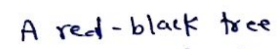

# Handwritten Text Recognition with TensorFlow
Handwritten Text Recognition (HTR) system implemented with TensorFlow (TF).
The model takes **images of single words or text lines (multiple words) as input** and **outputs the recognized text**.
3/4 of the words from the validation-set are correctly recognized, and the character error rate is around 10%.


## Run demo


* Go to the `src` directory 
* Run inference code:
  * Execute `python main.py` to run the model on an image of a word
 
The input images, and the expected outputs are shown below when the text line model is used.


```
> python main.py
Init with stored values from ../model/snapshot-13
Recognized: "A red-black tree"
Probability: 0.1608554720878601
```

